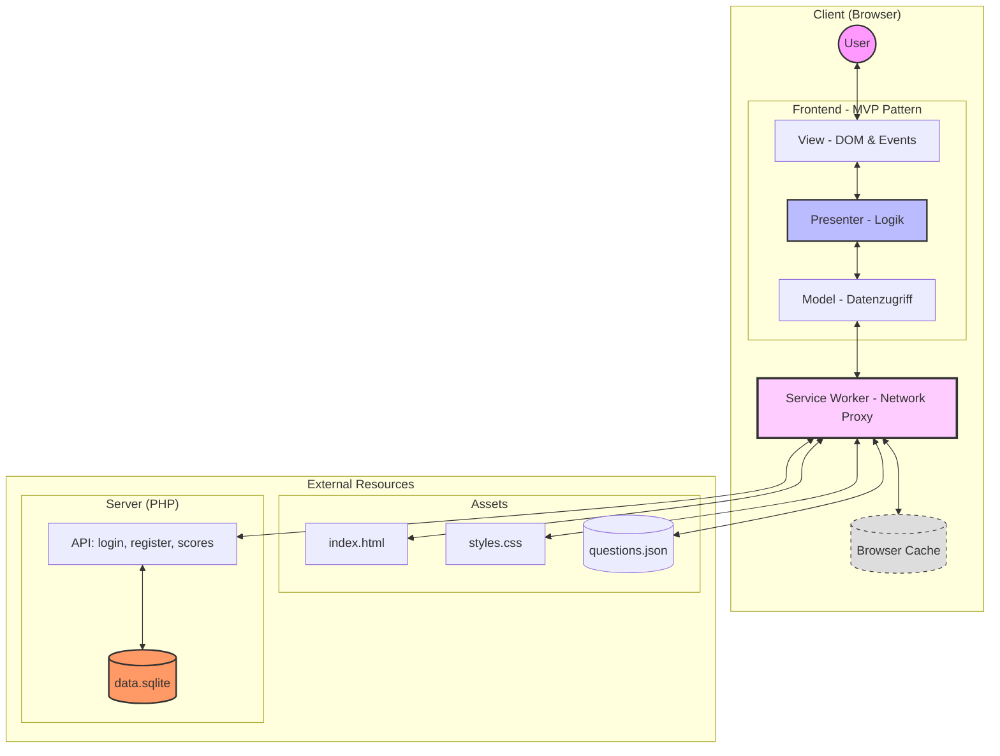

# Quizapp Architecture Diagram

This diagram illustrates the flow of data and the separation of concerns between the frontend (MVP pattern), the backend API, and the database.

### Component Breakdown
1.  **View**: Responsible for the visual representation and capturing user events (clicks, inputs).
2.  **Presenter**: Validates logic, coordinates between the Model and View. It tells the View what to show and the Model when to fetch data.
3.  **Model**: Manages application state and communicates with external APIs or local JSON files.
4.  **Service Worker**: Intercepts network requests to provide offline support (PWA).
5.  **PHP API**: Processes authentication and score persistence logic.
6.  **SQLite**: A lightweight database storing user credentials and leaderboard data.
